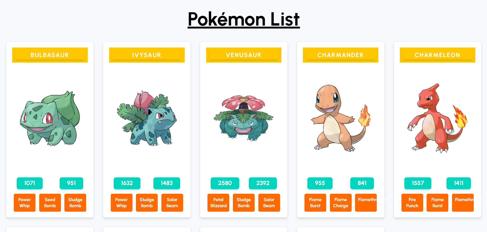
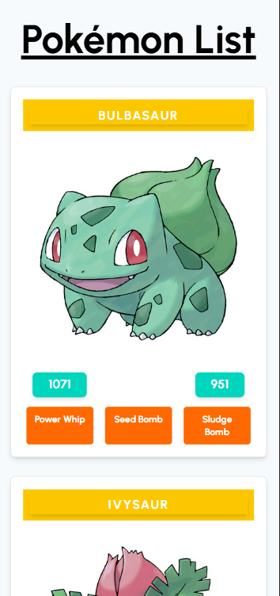

# Pokémon App (React & GraphQL)

This is a **Pokémon Application** built with **React** and **GraphQL**. It fetches Pokémon data from a remote GraphQL API and displays the list of Pokémon with detailed information, including their name, image, attacks, and stats. The app is fully responsive, ensuring a smooth experience across desktop and mobile devices.

## Features

- **Pokémon List**: Displays a list of Pokémon with their names, images, and stats.
- **Responsive Layout**: Adjusts the layout dynamically based on the screen size for optimal viewing experience.
- **Pokémon Details**: Shows detailed information about each Pokémon, including special attacks and stats like HP and CP.
- **GraphQL Integration**: Fetches data from a GraphQL API to dynamically display Pokémon information.
- **Mobile-first Design**: Fully responsive with mobile-first design principles to ensure accessibility and usability on all devices.

## Technologies Used

- **React**: A JavaScript library for building user interfaces.
- **Apollo Client**: A comprehensive state management library for managing GraphQL data in React.
- **GraphQL**: A query language for APIs, used to fetch data from the Pokémon API.
- **Tailwind CSS**: A utility-first CSS framework for designing a responsive and clean layout.
- **Vite**: A fast build tool for modern web projects.

## Setup and Installation

To set up the project locally, follow these steps:

### Prerequisites

- Node.js (version 14 or higher)
- npm (Node Package Manager) or yarn

### Steps to Run the Application

1. Clone the repository:
   ```bash
   git clone https://github.com/your-username/pokemon-app-react-and-graphql.git
   cd pokemon-app-react-and-graphql
   ```

2. Install dependencies:
   ```bash
   npm install
   ```
   or if you're using yarn:
   ```bash
   yarn install
   ```

3. Run the development server:
   ```bash
   npm start
   ```
   or using yarn:
   ```bash
   yarn start
   ```
 
4. Open the app in your browser at `http://localhost:3000`.

## File Structure

- **src/**
  - **App.jsx**: The main application component that initializes Apollo Client and renders the `PokemonsContainer`.
  - **containers/**
    - **PokemonsContainer.jsx**: Fetches and displays the list of Pokémon.
  - **components/**
    - **Pokemon.jsx**: Displays individual Pokémon data including their name, image, attacks, and stats.
  - **graphql/**
    - **get-pokemons.js**: Contains the GraphQL query for fetching the list of Pokémon.
  - **App.css**: The custom CSS file for global styling.
  
- **public/**: Contains the `index.html` and any static assets.

## How It Works

1. **Apollo Client**: The app uses Apollo Client to interact with the GraphQL API. It creates a new Apollo Client instance and provides it to the entire app through the ApolloProvider.
   
2. **GraphQL Query**: The `GET_POKEMONS` GraphQL query is used to fetch the list of Pokémon from the Pokémon API. The query includes details such as the Pokémon's name, image, stats, and special attacks.
   
3. **PokémonsContainer**: This component uses the `useQuery` hook from Apollo Client to fetch the data. It handles loading, error, and success states.
   
4. **Pokémon Component**: Each individual Pokémon is rendered using the `Pokemon` component, which receives the data as props and displays it. The layout is styled using Tailwind CSS for a responsive and clean design.

## Screenshots

### Desktop View:


### Mobile View:


## License

This project is open-source and available under the MIT License.
